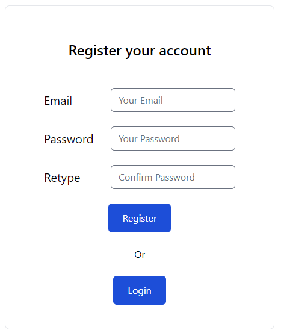
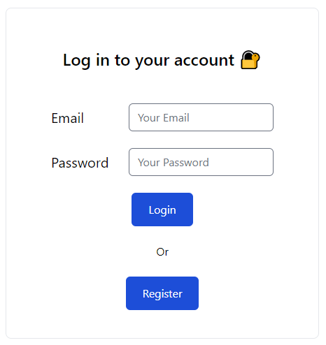
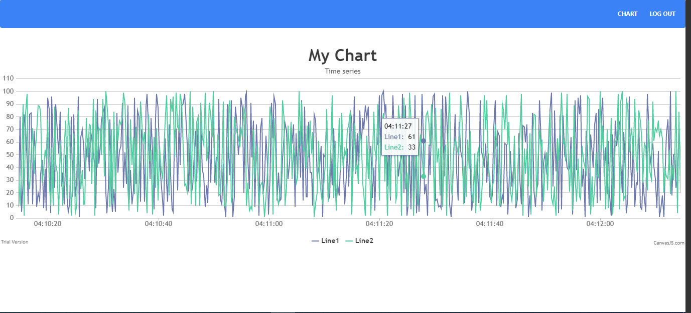

# Fullstack Excercise
## About the project

In this exercise, I was asked to build a simple react app with a python backend, bundled
to run inside a container. 
### Frontend(React)

Frontend was bootstrapped with [Create React App](https://github.com/facebook/create-react-app) and used TailwindCSS for stylesheet.

### Backend(Python - FastApi)

Backend was built by FastApi, python framework and used sqlite3 for data storage. \
For Authentication, Also used JWT(JSON Web Token).

## Run the project

In the frontend of project directory, you can run:

### `npm start`

Runs the app in the development mode.\
Open [http://localhost:3000](http://localhost:3000) to view it in your browser.

In the backend of project directory, you can run:
### `uvicorn src.main:app reload`

## Using

### Register

First, you should register your account. Please click `Register` button.

### Login

Then, you can click `Login` button.

### Dashboard

You can show the chart by clicking `Chart` button.
